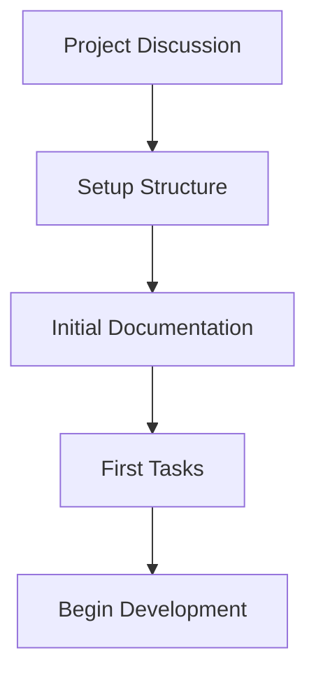
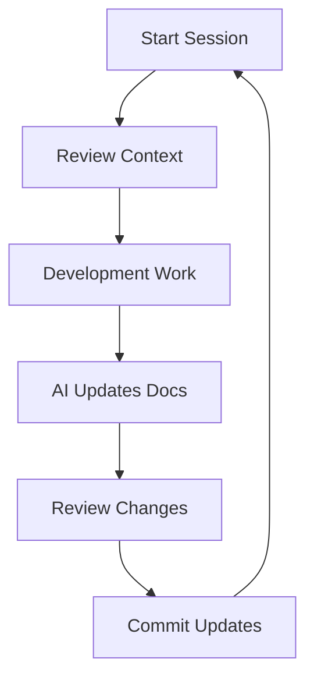
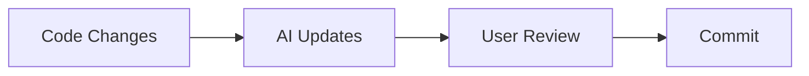
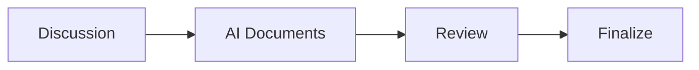
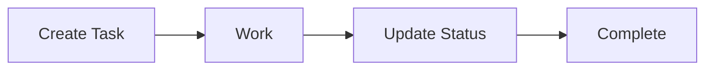

# AI Project Workflow Guide

## Development Lifecycle

### 1. Project Initialization


### 2. Development Cycle


## Session Workflow

### 1. Starting a Session

1. **Context Review**
   ```bash
   # Point AI to context
   cd your-project
   # Discuss current state in .context/
   ```

2. **Goal Setting**
   - Review current tasks
   - Set session objectives
   - Identify blockers

3. **State Check**
   - Current project status
   - Open issues
   - Previous session notes

### 2. During Development

1. **Code Changes**
   - Implement features
   - Fix issues
   - Refactor code

2. **Documentation**
   - AI updates docs
   - Tracks decisions
   - Records progress

3. **Communication**
   - Discuss changes
   - Ask questions
   - Get AI assistance

### 3. Session Wrap-up

1. **Review**
   - Check AI's updates
   - Verify documentation
   - Confirm progress

2. **Commit**
   - Review changes
   - Commit updates
   - Push changes

3. **Next Steps**
   - Plan next session
   - Note open items
   - Set priorities

## Documentation Flow

### 1. Context Updates


### 2. Decision Records


### 3. Task Tracking


## Best Practices

### 1. Communication
- Clear objectives
- Regular updates
- Consistent terminology
- Document decisions

### 2. Documentation
- Let AI maintain
- Regular reviews
- Keep current
- Be consistent

### 3. Version Control
- Regular commits
- Clear messages
- Document with code
- Clean history

## Common Workflows

### 1. Feature Development
1. Create task
2. Discuss with AI
3. Implement
4. Update docs
5. Review
6. Commit

### 2. Bug Fixing
1. Document issue
2. Investigate
3. Fix
4. Test
5. Update docs
6. Commit

### 3. Refactoring
1. Plan changes
2. Document decision
3. Implement
4. Update docs
5. Test
6. Commit

## Tips and Tricks

### 1. Efficiency
- Use AI effectively
- Automate where possible
- Regular commits
- Clear communication

### 2. Quality
- Regular reviews
- Consistent patterns
- Complete documentation
- Thorough testing

### 3. Maintenance
- Clean as you go
- Regular updates
- Remove obsolete
- Stay organized
