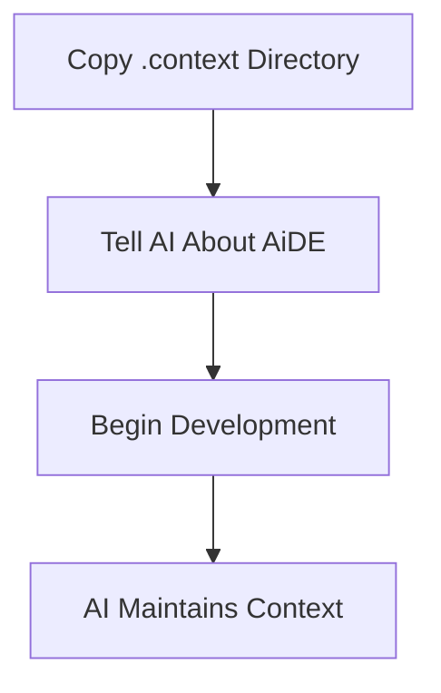
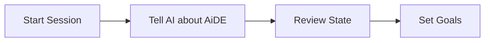
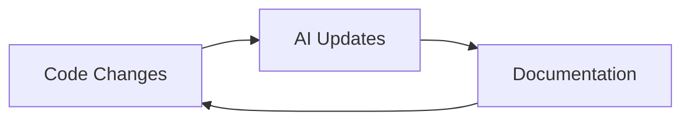
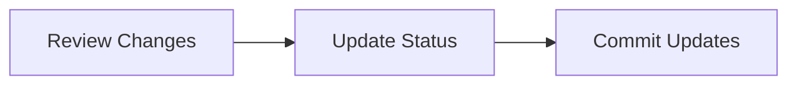

# AiDE Workflow Guide

## Overview

AiDE is a drop-in framework that structures how you work with AI assistants. By maintaining a `.context` directory, the AI can track project state, decisions, and progress across development sessions.

## Getting Started



1. **Add to Your Project**
   ```bash
   cp -r AiDE/.context your-project/
   ```

2. **Start Using AiDE**
   - Tell AI "I'm using the AiDE methodology"
   - AI will maintain the `.context` directory

## Development Workflow

### 1. Starting a Session



1. **Context Setup**
   - Tell AI you're using AiDE
   - AI reviews `current_state.md`
   - Discuss session goals

2. **State Review**
   - Current project status
   - Open tasks
   - Recent decisions

### 2. During Development



1. **Code Work**
   - Implement features
   - Fix bugs
   - Refactor code

2. **AI Documentation**
   - Updates current state
   - Records decisions
   - Tracks tasks
   - Maintains session notes

3. **Continuous Context**
   - AI understands project state
   - Provides relevant suggestions
   - Maintains continuity

### 3. Ending a Session



1. **Review**
   - Check AI's documentation
   - Verify state updates
   - Confirm progress

2. **Wrap Up**
   - Commit `.context` changes
   - Note next steps
   - Set next priorities

## Context Structure

### 1. Current State (`current_state.md`)
- Project status
- Active features
- Technical state
- Recent changes

### 2. Roadmap (`roadmap.md`)
- Priority goals
- Active initiatives
- Future direction
- Achievement tracking

### 3. Decisions (`decisions/`)
- Architecture choices
- Technical decisions
- Implementation approaches
- Each decision in separate file

### 4. Tasks (`tasks/`)
- Current work items
- Progress tracking
- Dependencies
- Validation criteria

### 5. Sessions (`sessions/`)
- Development sessions
- Changes made
- Decisions taken
- Next steps

## Best Practices

### 1. State Management
- Let AI maintain state
- Review changes regularly
- Keep state current
- Commit with code

### 2. Decision Records
- One decision per file
- Include context
- Note alternatives
- Track consequences

### 3. Task Tracking
- Clear descriptions
- Defined objectives
- Track progress
- Note blockers

### 4. Session Records
- Regular summaries
- Track progress
- Note challenges
- Plan ahead

## Tips for Success

### 1. AI Collaboration
- Be explicit about using AiDE
- Trust AI to maintain docs
- Review AI's updates
- Provide clear context

### 2. Documentation
- Commit context changes
- Keep templates clean
- Use consistent format
- Regular updates

### 3. Project Evolution
- Let AI suggest improvements
- Adapt templates as needed
- Keep what works
- Remove what doesn't
